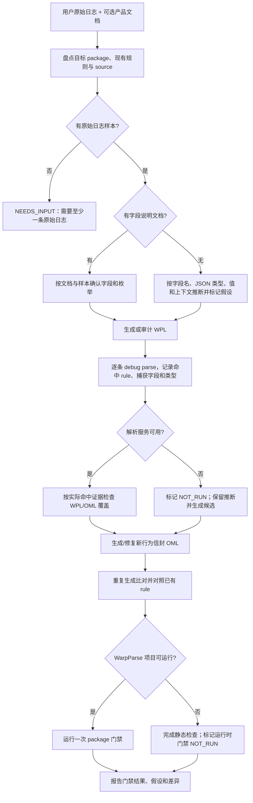

# WPL/OML 生成、富化与验证流程

## 总体流程



## 四类入口场景

| 场景 | 处理方式 |
| --- | --- |
| 用户提供原始文档和样本 | 按文档字段定义/枚举与样本交叉核对，生成 WPL 和 OML |
| 用户只提供样本 | 根据字段名、JSON 类型、样本值和字段关联推断；标注关键假设后继续生成 |
| 已有 WPL + OML | 逐条解析样本，检查实际命中、字段类型、OML 消费和新行为信封 |
| WPL 存在、OML 缺失/不合规 | 先补齐 WPL 捕获，再依据解析结果重建 OML |
| 新规范复核 | 搜索旧信封和旧字段，修正后重跑 package 门禁 |

缺少产品原始文档本身不会触发 `NEEDS_INPUT`。没有原始日志、无法从样本或现有规则判断目标路由，或关键证据互相矛盾且影响必需语义时，才报告 `NEEDS_INPUT`。字段语义的推断需在结果中说明，不能写成文档已确认事实。

## 唯一项目级验证入口

```bash
python3 .agents/skills/wpl-rule-check/scripts/check_pipeline.py \
  --package <package> \
  --sample data/in_dat/<package>/<sample>.dat \
  --source-file <package>/<sample>.dat \
  --clear-output --run-batch
```

对话中提供的样本需要临时保存到 `data/in_dat/<package>/` 后才能由 file source 运行；`--source-file` 路径相对于 `data/in_dat/`。验证后清理临时副本。

脚本执行一次 `wpadm check`、逐条本地 debug parse 和一次 `wparse batch`，检查：

- WPL/OML 静态结构和精确 rule 路由；
- 每条输入命中、字段值与运行时类型；
- 单个 rule 范围内 WPL 捕获字段与 OML 消费情况；
- 行为 Schema、枚举、实体 `ref_id` 和时间戳；
- 业务输出和 raw 输出数量、原文关联；
- `sdm2_log.sdm_event_behavior` 的物理列投影与 Doris 契约；
- `git diff --check`。

`--clear-output` 会清空 `data/out_dat/all.json` 和 `raw_log.json`，并保留本轮结果供检查。需要恢复既有输出时加 `--restore-output`；脚本会恢复 source 配置。解析证据默认在报告后清理，需要留档时加 `--keep-evidence`。不要将 NDJSON 多行拼成一次 debug parse 请求；脚本会逐条调用。

## 门禁状态

- `OK`：所有本地可运行的阻断门禁通过。
- `FAIL`：语法、Schema、字段覆盖、数量、投影或枚举不合规。
- `NEEDS_INPUT`：缺少原始样本，或样本和现有证据不足以确定必需路由/语义。
- `NOT_RUN`：解析服务、富化服务或完整 WarpParse 项目不可用；如实说明未运行的步骤。

用户未提供字段说明时仍应生成候选规则；如果关键结果证据不充分，将语义假设及 `unknown`/`NEEDS_INPUT` 状态写进交付说明。不得用静默默认值制造“全部通过”。
